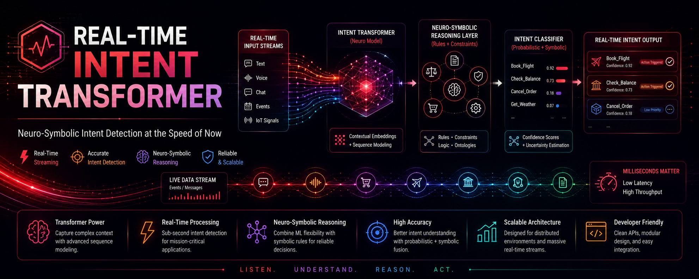

<h1 align="center">Real-Time Intent Transformer</h1>

<p align="center">
  
</p>

<p align="center">
  <b>A production-grade, dual-path e-commerce intent classification system with deterministic fast-path (System 1), LangGraph agentic reasoning (System 2), OPA governance, background meta-cognition, and end-to-end Langfuse observability.</b>
</p>

<p align="center">
  
  
  
  
  
  
  
  
  
  
  
  
  
</p>

---

## What Problem Does This Solve?

E-commerce platforms lose revenue because they treat all users the same. A user browsing 20 pages without adding to cart needs a different intervention than one with a full cart who started checkout.

**Real-Time Intent Transformer** classifies live shopping sessions into 7 intent categories (BROWSE, COMPARE, CART_BUILDER, CHECKOUT_INTENT, PRICE_SENSITIVE, CHURN_RISK, LOYAL_RETURNER) and dispenses targeted actions (discounts, urgency, abandon recovery) within 50ms on CPU — with zero external API dependencies.

> **"Perceive-Reason-Govern-Execute"**: Every clickstream event flows through a dual-path neuro-symbolic pipeline. The fast path handles deterministic cases in <50ms. Complex or ambiguous sessions escalate to an LLM-powered agentic path with GraphRAG retrieval, validated by a Critic agent against OPA governance policies. A background meta-cognitive evaluator continuously monitors action efficacy and detects model drift.

---

## Architecture

### Dual-Path Design

```
                          ┌─────────────────────────────┐
                          │     Incoming Click Event     │
                          └──────────────┬──────────────┘
                                         │
                          ┌──────────────▼──────────────┐
                          │   Complexity Router          │
                          │   (confidence < threshold    │
                          │    or complex intent?)       │
                          └──────┬───────────────┬──────┘
                                 │               │
                    ┌────────────▼──┐    ┌───────▼────────────┐
                    │  System 1     │    │  System 2           │
                    │  Fast Path    │    │  Agentic Path       │
                    │  (<50ms)      │    │  (unlimited)        │
                    │               │    │                     │
                    │  ML Ensemble  │    │  LLM Planner        │
                    │  + Rules      │    │  + GraphRAG         │
                    │  + Markov     │    │  + Critic Agent     │
                    └───────┬───────┘    └────────┬────────────┘
                            │                     │
                            │            ┌────────▼────────────┐
                            │            │  OPA Critic         │
                            │            │  (governance gate)  │
                            │            └────────┬────────────┘
                            │                     │
                    ┌───────▼─────────────────────▼──────┐
                    │       Action Dispatcher             │
                    │  (suppression + audit ledger)       │
                    └────────────────┬────────────────────┘
                                     │
                    ┌────────────────▼────────────────────┐
                    │   Background Meta-Cognitive Evaluator│
                    │   (drift detection + LLM-as-Judge)  │
                    └─────────────────────────────────────┘
```

### System 1 — Deterministic Fast Path (<50ms)

The fast path processes high-confidence, straightforward intents through a deterministic pipeline:

| Stage | Component | Technology | Latency |
|-------|-----------|------------|---------|
| **Ingestion** | Kafka Producer/Consumer | `aiokafka`, FastAPI | Async streaming |
| **Hydration** | Session + Event Store | SQLite / Redis | <5ms |
| **Perception** | Feature Engineer | **Polars** | <5ms (15+ behavioral features) |
| **Reasoning** | ML Ensemble | Rule heuristic + Markov chain + sklearn RF + XGBoost | <10ms rule, <50ms ML |
| **Governance** | OPA Policy Engine | OPA/Rego + Python fallback | 50ms timeout |
| **Execution** | Action Dispatcher | FastAPI | 6 action types with suppression |
| **Ledger** | Audit Trail | PostgreSQL / SQLite | Immutable action log |

### System 2 — Agentic Reasoning (LangGraph)

When confidence is below threshold or intent is complex (CHURN_RISK, LOYAL_RETURNER), sessions escalate to the agentic path:

1. **LLM Planner** — Proposes an action using session context + GraphRAG product retrieval
2. **GraphRAG Tools** — Neo4j graph queries for product relationships and customer history
3. **Critic Agent** — Validates the proposed action against OPA governance policies
   - If OPA allows → approve unchanged
   - If OPA denies → rewrite to compliant fallback via LLM
   - If rewrite fails → hard NO_ACTION

State persistence uses LangGraph checkpointing (PostgresSaver in production, MemorySaver for local dev).

### Background Meta-Cognition

A persistent background worker periodically:
- Fetches recent actions from the PostgreSQL ledger
- Correlates actions with user conversion events
- Uses LLM-as-a-Judge to diagnose failed interventions
- Detects model drift (declining efficacy over time)
- Persists aggregated metrics to `evaluation_metrics` table

### Governance & Safety

- **OPA/Rego policies** with Python fallback for offline evaluation
- **Anti-gaming**: No duplicate discounts within 15 minutes; max 3 discounts/month
- **Fairness guardrails**: No demographic-based pricing discrimination
- **Action suppression**: Deduplication within configurable time windows
- **Audit trail**: Immutable ledger of every dispatched action with intent, confidence, and reason
- **Deterministic idempotency**: SHA-256 keys from `session_id:action:minute_bucket` prevent duplicate actions

---

## Observability — Langfuse Integration

This engine uses [Langfuse](https://langfuse.com) for real-time observability across both deterministic policy routes and agentic decision flows.

```
       ┌─────────────────────────────────────────────────────────┐
       │                   FastAPI / API Route                   │
       └────────────────────────────┬────────────────────────────┘
                                    │
            ┌───────────────────────┴───────────────────────┐
            ▼                                               ▼
┌─────────────────────────┐                     ┌─────────────────────────┐
│       System 1          │                     │        System 2         │
│  Fast-Path / OPA Policy │                     │  LangGraph Multi-Agent  │
└───────────┬─────────────┘                     └───────────┬─────────────┘
            │                                               │
            ▼                                               ▼
   [@observe Decorator]                          [Langfuse CallbackHandler]
   - Latency tracking (<15ms)                    - Node-by-node state spans
   - Fallback evaluations                        - Graph state inputs/outputs
            │                                               │
            └───────────────────────┬───────────────────────┘
                                    │
                                    ▼
                      ┌───────────────────────────┐
                      │      Langfuse Cloud       │
                      │  Tracing & Analytics UI   │
                      └───────────────────────────┘

```
End-to-end distributed tracing operates with zero-config setup across the stack:


| Component | Tracing | What's Captured |
|-----------|---------|-----------------|
| **OPA Client** | `@observe()` decorator | Evaluation latency, fallback path, allow/deny decisions |
| **Classify Endpoint** | `@observe()` decorator | Full request lifecycle for intent prediction |
| **LangGraph Orchestrator** | `CallbackHandler` | Planner, GraphRAG tools, Critic agent as nested spans |
| **Evaluator Agent** | `@observe()` decorator | Background batch traces, LLM analysis spans |

**Key Tracing Capabilities**
System 1 (Fast-Path Latency): Tracks deterministic policy evaluations via @observe() decorators to ensure compliance checks remain under target thresholds (<= 15ms).

System 2 (LangGraph Execution): Injects a native CallbackHandler into graph invocations (graph.ainvoke), capturing nested node execution trees (__start__ -> route_by_complexity -> system_1_fast_path -> __end__), along with input feature flags and output routing decisions.

Meta-Cognition Evaluators: Records background drift detection runs and batch confidence scores into decoupled trace scopes.


### Configuration

Add to your `.env`:

```bash
LANGFUSE_PUBLIC_KEY=pk-lf-...
LANGFUSE_SECRET_KEY=sk-lf-...
LANGFUSE_HOST=http://localhost:3000  # default
```

*Note on Testing: The test suite automatically disables external telemetry network requests via LANGFUSE_SDK_DISABLED=true in tests/conftest.py to prevent suite latency or external network dependency failures.*

Traces are automatically exported as nested spans within the main request trace, giving you full visibility into:
- Which path (System 1 vs System 2) was taken and why
- LLM latency and token usage for each agent call
- OPA policy evaluation timing and outcomes
- GraphRAG retrieval results
- Critic approval/rewrite decisions

---

## Production Readiness

### Checklist (19/19 items passing)

| Priority | Item | Status |
|----------|------|--------|
| **P0** | OPA policy drift bug (total_purchases gate) | Fixed |
| **P0** | LangGraph PostgreSQL checkpointing | Fixed |
| **P1** | Deterministic action idempotency keys | Fixed |
| **P1** | OPA timeout & async fallback (50ms) | Fixed |
| **P1** | Defensive timeouts (critic 15s, evaluator 30s, Neo4j 5s) | Fixed |
| **P1** | LLM concurrency limiter (Semaphore) | Fixed |
| **P1** | Read-replica support for evaluator | Fixed |
| **P2** | State bounding (MAX_STATE_EVENTS=50) | Fixed |
| **P2** | Event store TTL cleanup (24h) | Fixed |
| **P2** | Prometheus drift gauge + batch metrics | Fixed |
| **P2** | Prompt injection security test suite | Fixed |

### Key Hardening Details

- **OPA**: Singleton `httpx.AsyncClient` with connection pooling; 50ms timeout with `asyncio.to_thread` fallback
- **Checkpointing**: `PostgresSaver` with `autocommit=True, prepare_threshold=0`; `MemorySaver` fallback
- **Idempotency**: SHA-256 deterministic keys allow `ON CONFLICT` deduplication in PostgreSQL
- **State Bounding**: `MAX_STATE_EVENTS=50` truncation prevents checkpoint bloat
- **Event TTL**: `delete_expired_events(ttl_hours=24)` prevents unbounded SQLite growth
- **Concurrency**: `asyncio.Semaphore(10)` on evaluator LLM calls prevents OOM under burst
- **Read Replicas**: Evaluator batch reads route to configured replica to avoid hot-path lock contention

---

## Installation

### Prerequisites

- Python 3.11+
- Docker & Docker Compose (for Kafka + OPA + Zookeeper)
- (Optional) Ollama for local LLM inference
- (Optional) PostgreSQL for checkpointing and audit ledger
- (Optional) Neo4j for GraphRAG product retrieval
- (Optional) Langfuse for observability

### Quick Start

```bash
# 1. Clone repository
git clone https://github.com/aragit/real-time-intent-transformer.git
cd real-time-intent-transformer

# 2. Create virtual environment
python3 -m venv .venv
source .venv/bin/activate

# 3. Install dependencies
pip install -e ".[dev]"

# 4. Start infrastructure (Kafka + Zookeeper + OPA)
docker compose -f docker/docker-compose.yml up -d

# 5. Configure environment
cp .env.example .env  # edit with your settings

# 6. Launch API
uvicorn src.main:app --host 0.0.0.0 --port 8000 --reload
```

### With Pre-Trained Model

```bash
python scripts/generate_clickstream.py
python scripts/train_model.py
# Saves models/intent_classifier.joblib
```

### With Langfuse Observability

```bash
# Start Langfuse (self-hosted or cloud)
docker compose -f docker/docker-compose.langfuse.yml up -d

# Add to .env
echo "LANGFUSE_PUBLIC_KEY=pk-lf-..." >> .env
echo "LANGFUSE_SECRET_KEY=sk-lf-..." >> .env
```

---

## API Reference

Interactive docs: `http://localhost:8000/docs`

### Event Ingestion

```bash
curl -X POST http://localhost:8000/events/ingest \
  -H "Content-Type: application/json" \
  -d '{
    "session_id": "sess_001",
    "customer_id": "cust_001",
    "action": "add_to_cart",
    "product_id": "prod_001",
    "category": "electronics",
    "value": 99.99
  }'
```

### Intent Prediction

```bash
curl http://localhost:8000/sessions/sess_001/intent
```

**Response:**
```json
{
  "session_id": "sess_001",
  "intent": "CHECKOUT_INTENT",
  "confidence": 0.857,
  "method": "rule_based",
  "features": {
    "session_duration_sec": 245.0,
    "page_views": 3,
    "cart_adds": 2,
    "checkouts": 1,
    "total_cart_value": 199.98
  },
  "predicted_next_state": "PURCHASE",
  "generated_at": "2024-01-15T10:30:00Z"
}
```

### Session Features

```bash
curl http://localhost:8000/sessions/sess_001/features
```

### Markov Chain Prediction

```bash
curl http://localhost:8000/sessions/sess_001/markov
```

### Intent Distribution

```bash
curl http://localhost:8000/intents/distribution
```

### Health Check

```bash
curl http://localhost:8000/health
```

---

## Testing

```bash
# Run full test suite
pytest tests/ -v

# Run with coverage
pytest tests/ -v --cov=src --cov-report=term-missing

# Run specific test categories
pytest tests/test_critic_security.py -v  # Prompt injection security tests
pytest tests/test_evaluator.py -v        # Evaluator agent tests
pytest tests/test_orchestrator.py -v     # Orchestrator graph tests
```

### Test Suite: 226/226 Passing

| Test Category | Count | Coverage |
|---------------|-------|----------|
| Evaluator Agent | 29 | Core batch processing, drift detection, LLM analysis |
| Evaluator Worker | 8 | Lifecycle, Prometheus metrics, error handling |
| Critic Agent | 12 | OPA validation, rewrite, hard rejection |
| Critic Security | 8 | Prompt injection, markdown jailbreak, Unicode bypass |
| Orchestrator Graph | 15 | System 1/2 routing, state transitions, checkpointing |
| Pipeline | 18 | Hydration, feature engineering, governance |
| API Routes | 22 | All endpoints, error handling |
| Models | 15 | Events, actions, features, intents |
| Memory Stores | 18 | SQLite, Redis, session/event stores |
| Reasoning | 12 | ML ensemble, Markov chain, rule classifier |
| Execution | 15 | Dispatcher, suppressor, ledger |
| Governance | 12 | OPA client, business rules |
| Integration | 12 | End-to-end flows |
| Benchmarks | 18 | Latency regression tests |

---

## Synthetic Data & Model Performance

### Dataset

- **Total events:** 34,148
- **Total sessions:** 5,000
- **Dataset:** `data/synthetic_clicks.csv`

### Intent Distribution

| Intent Category | Count |
|-----------------|------:|
| BROWSE | 7,180 |
| PRICE_SENSITIVE | 7,070 |
| COMPARE | 6,880 |
| CART_BUILDER | 5,824 |
| CHECKOUT_INTENT | 3,610 |
| LOYAL_RETURNER | 2,130 |
| CHURN_RISK | 1,454 |

### Classification Report

| Class | Precision | Recall | F1-score | Support |
|-------|----------:|-------:|---------:|--------:|
| BROWSE | 1.00 | 1.00 | 1.00 | 144 |
| CART_BUILDER | 1.00 | 1.00 | 1.00 | 146 |
| CHECKOUT_INTENT | 1.00 | 1.00 | 1.00 | 144 |
| CHURN_RISK | 1.00 | 1.00 | 1.00 | 145 |
| COMPARE | 1.00 | 1.00 | 1.00 | 138 |
| LOYAL_RETURNER | 1.00 | 1.00 | 1.00 | 142 |
| PRICE_SENSITIVE | 1.00 | 1.00 | 1.00 | 141 |


---

## Project Structure

```
real-time-intent-transformer/
├── src/
│   ├── agents/
│   │   ├── orchestrator.py      # LangGraph dual-path router
│   │   ├── planner.py           # LLM Planner Agent
│   │   ├── critic.py            # Critic Agent (OPA validation)
│   │   ├── evaluator.py         # Background Meta-Cognitive Evaluator
│   │   └── tools/
│   │       └── graph_retriever.py  # Neo4j GraphRAG tools
│   ├── api/routes/
│   │   ├── events.py            # Event ingestion endpoints
│   │   ├── sessions.py          # Intent prediction endpoints
│   │   ├── intents.py           # Intent distribution
│   │   ├── actions.py           # Action history
│   │   ├── customers.py         # Customer profiles
│   │   └── health.py            # Health checks
│   ├── governance/
│   │   ├── opa_client.py        # OPA/Rego policy engine
│   │   └── business_rules.py    # Python fallback rules
│   ├── execution/
│   │   ├── dispatcher.py        # Action dispatcher
│   │   ├── suppressor.py        # Deduplication/suppression
│   │   ├── ledger.py            # Audit ledger interface
│   │   ├── pg_ledger.py         # PostgreSQL ledger
│   │   └── sqlite_ledger.py     # SQLite ledger
│   ├── memory/
│   │   ├── session_store.py     # Session state store
│   │   ├── event_store.py       # Event history store
│   │   ├── customer_profile.py  # Customer profile store
│   │   ├── redis_store.py       # Redis adapter
│   │   └── sqlite_store.py      # SQLite adapter
│   ├── reasoning/
│   │   ├── ml_ensemble.py       # ML ensemble classifier
│   │   ├── markov_model.py      # Markov chain predictor
│   │   ├── rule_classifier.py   # Rule-based classifier
│   │   └── slm_enrichment.py    # SLM enrichment (stub)
│   ├── perception/
│   │   ├── feature_engineer.py  # Polars feature engineering
│   │   └── session_window.py    # Sliding window manager
│   ├── observability/
│   │   ├── metrics.py           # Prometheus metrics
│   │   └── logging.py           # Loguru configuration
│   ├── ingestion/
│   │   ├── kafka_consumer.py    # Kafka consumer
│   │   └── kafka_producer.py    # Kafka producer
│   ├── workers/
│   │   └── evaluator_worker.py  # Background evaluator loop
│   ├── models/                  # Pydantic data models
│   ├── config.py                # Settings (pydantic-settings)
│   ├── main.py                  # FastAPI application
│   └── pipeline.py              # System 1 hot-path pipeline
├── tests/
│   ├── test_critic_security.py  # Prompt injection security tests
│   ├── test_evaluator.py        # Evaluator agent tests
│   ├── test_evaluator_worker.py # Worker lifecycle tests
│   ├── test_orchestrator.py     # Orchestrator graph tests
│   ├── test_critic.py           # Critic agent tests
│   ├── test_pipeline.py         # Pipeline tests
│   ├── test_api.py              # API endpoint tests
│   └── conftest.py              # Pytest fixtures + Langfuse disable
├── policies/
│   └── ecommerce.rego           # OPA Rego policies
├── docker/
│   └── docker-compose.yml       # Infrastructure services
├── scripts/
│   ├── generate_clickstream.py  # Synthetic data generation
│   └── train_model.py           # Model training
├── pyproject.toml               # Project config + dependencies
└── README.md
```

---

## Technology Stack

| Category | Technology | Purpose |
|----------|------------|---------|
| **Runtime** | Python 3.11+ | Core language |
| **API** | FastAPI + Uvicorn | Async HTTP server |
| **Agentic** | LangGraph | Stateful multi-agent orchestration |
| **LLM** | Ollama / OpenAI | Local or cloud LLM inference |
| **GraphRAG** | Neo4j | Product relationship queries |
| **Policy** | OPA/Rego | Governance & compliance rules |
| **ML** | scikit-learn + XGBoost | Ensemble classification |
| **Features** | Polars | High-performance data processing |
| **Streaming** | Apache Kafka | Clickstream event ingestion |
| **Storage** | PostgreSQL + SQLite | Ledger, checkpointing, sessions |
| **Cache** | Redis | Session state caching |
| **Observability** | Langfuse | Distributed tracing & LLM monitoring |
| **Metrics** | Prometheus | Operational metrics |
| **Testing** | pytest + pytest-asyncio | 226 tests, 79% coverage |

---

## Contributing

Contributions welcome in:
- Additional intent classes (BARGAIN_HUNTER, GIFT_SHOPPER)
- Real-time bidding (RTB) integration patterns
- Multi-modal intent (image search, voice queries)
- Reinforcement learning for action optimization
- Load testing and performance benchmarks

---

## License

MIT License — AI Engineering Portfolio

---

<p align="center">
  <sub>Built with FastAPI, LangGraph, Polars, Kafka, and a deep respect for deterministic reasoning.</sub>
</p>
